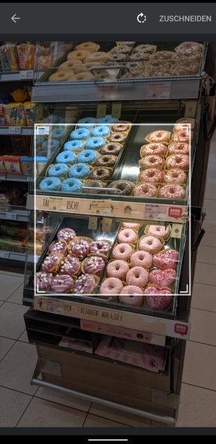

# Titanium Image Cropping Tool (Android)

Android image crop based on: https://github.com/CanHub/Android-Image-Cropper



For the <b>iOS version</b> have a look at https://github.com/hansemannn/titanium-image-crop

## 📢 Attention:
You have to use a `lifecycleContainer` like this:
```javascript
var ImageCrop = require('ti.imagecrop').createImageCrop({
	lifecycleContainer: win
});
```
before you call the methods and add
```
repositories {
	maven { url 'https://jitpack.io' }
}
```
to your `/app/platform/android/build.gradle`

## Methods:

* `createImageCrop`
	* Paremeter:
		* lifecycleContainer
		* showCamera: when `showCropDialog` - `image` is empty it will show/hide the camera option
		* showGallery: when `showCropDialog` - `image` is empty it will show/hide the gallery option


* `showCropDialog`
	* Parameters:
		- `image` (String) - path to file; if empty it will show an image picker

## Events:

* `done`
	* Parameter: `image` (TiBlob) - cropped image
* `cancel`


## Example:

```javascript
var win = Ti.UI.createWindow();

var ImageCrop = require('ti.imagecrop').createImageCrop({
	lifecycleContainer: win,
	// showCamera: false,
	// showGallery: false
});
ImageCrop.addEventListener("done", function(e) {
	img.image = e.image;
});
ImageCrop.addEventListener("cancel", function(e) {
	alert("cancel");
});

var img = Ti.UI.createImageView({
	top: 0
});
var btn = Ti.UI.createButton({
	title: "crop image",
	bottom: 0
});
var btn2 = Ti.UI.createButton({
	title: "select image",
	bottom: 50
});
win.add(img);
win.add(btn);
win.add(btn2);
btn.addEventListener("click", function() {
	Ti.Media.openPhotoGallery({
		success: function(e) {
			// crop image
			ImageCrop.showCropDialog({
				image: e.media.nativePath
			})
		}
	})
})
btn2.addEventListener("click", function() {
	// show image picker
	ImageCrop.showCropDialog({})
})

win.open();
```

## TODO

`Android-Image-Cropper` has lots of customization options (e.g. disable/allow rotation, predefined ratios).

## Author
Michael Gangolf (<a href="https://github.com/m1ga">@MichaelGangolf</a> / <a href="https://www.migaweb.de">Web</a>)


<span class="badge-buymeacoffee"><a href="https://www.buymeacoffee.com/miga" title="donate"></a></span>
